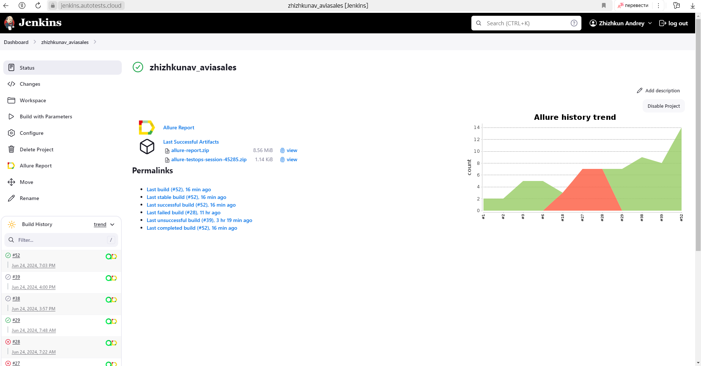
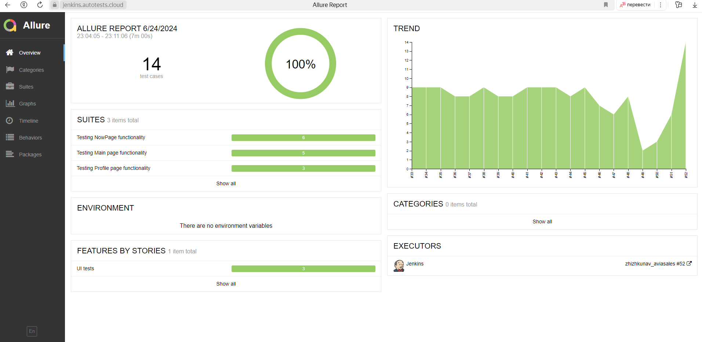
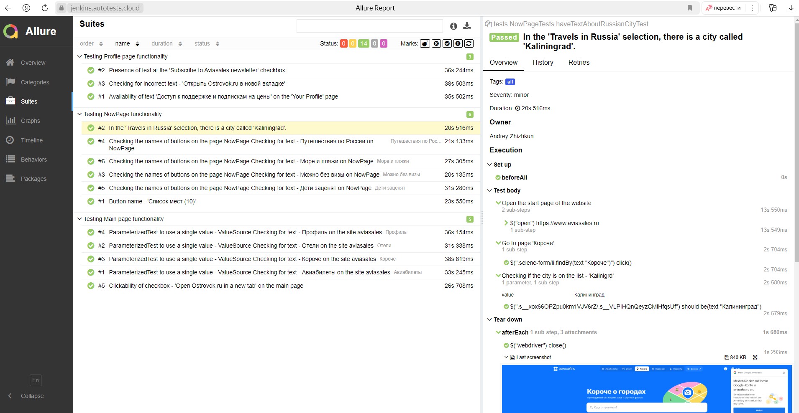
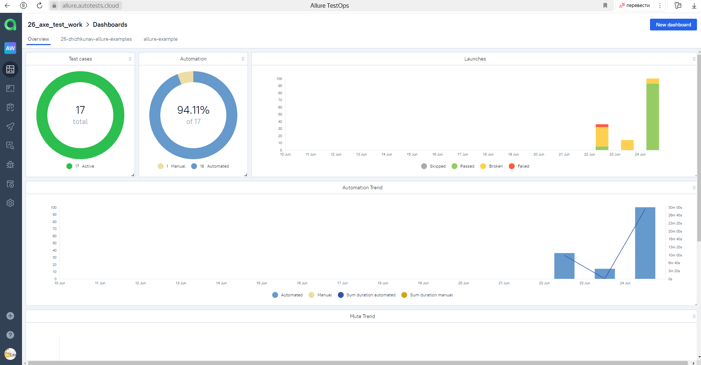
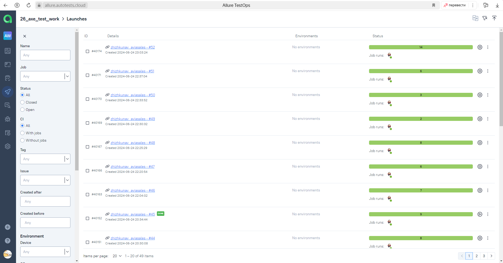

# Training project to automate test scenarios for the company's website of [aviasales](https://www.aviasales.ru/)

---

Aviasales is the largest service in Russia for searching and purchasing air tickets. 
Here you can find flights from 2000+ airlines and fly to 193 countries.

<a href="https://www.aviasales.ru/"></a>

---

## Content:

- <a href="#tools">Technologies</a>
- <a href="#scenarios">Test scenarios</a>
- <a href="#jenkins">CI/CD with Jenkins</a>
- <a href="#cli">Launch from the CLI</a>
- <a href="#allure">Allure reporting</a>
- <a href="#allure-testops">Integration with Allure TestOps</a>
- <a href="#jira">Integration with JIRA</a>
- <a href="#telegram">Bot notifications in Telegram</a>
- <a href="#video">Examples of test execution</a>


<a id="tools"></a>
## Tools and technologies:
<p align="center">
<a href="https://www.jetbrains.com/idea/"></a>  
<a href="https://www.java.com/"></a>  
<a href="https://github.com/"></a>  
<a href="https://junit.org/junit5/"></a>  
<a href="https://gradle.org/"></a>  
<a href="https://selenide.org/"></a>  
<a href="https://aerokube.com/selenoid/"></a>  
<a href="https://github.com/allure-framework/allure2"></a>
<a href="https://qameta.io/"></a>   
<a href="https://www.jenkins.io/"></a>  
<a href="https://www.atlassian.com/ru/software/jira/"></a>
<a href="https://telegram.org//"></a>
</p>

<a id="scenarios"></a>
## Test Scenarios

* [x] Clickability of checkbox - 'Open Ostrovok.ru in a new tab' on the main page
* [x] Checking for text on the site aviasales (@ParameterizedTest)
* [x] Checking the names of buttons on the page NowPage
* [x] In the 'Travels in Russia' selection, there is a city called 'Kaliningrad'
* [x] Button name - 'List of places (10)'
* [x] Availability of text 'Access to support and pricing subscriptions' on the 'Your Profile' page
* [x] Presence of text at the 'Subscribe to Aviasales newsletter' checkbox
* [x] Checking for incorrect text - 'Open Ostrovok.ru in new page'

<a id="jenkins"></a>
## </a><a name="CI/CD with Jenkins"></a>CI/CD with [Jenkins](https://jenkins.autotests.cloud/job/zhizhkunav_aviasales/)</a>
 

### Jenkins parameters:

- `TASK` (all tests will be launched by `all_test` by default)
- `BROWSER` (browser, `chrome` by default)
- `BROWSER_VERSION` (version of browser, `120` by default)
- `BROWSER_SIZE` (browser windows size, `1920x1080` by default)
- `WD_HOST` (data of remote Selenoid server)


**Remote Jenkins launch:**
```bash  
clean ${TASK} -Dbrowser=${BROWSER} -DbrowserVersion=${BROWSER_VERSION} -DbrowserSize=${BROWSER_SIZE} -DwdHost=${WD_HOST}
```

<a id="allure"></a>
## </a> <a name="Allure"></a>Allure [reporting](https://jenkins.autotests.cloud/job/zhizhkunav_aviasales/3/allure/)</a>
 

`Allure` report includes:
- Test steps
- Screenshot of the page at the last step
- Page Source
- Browser console logs
- Video of execution for automated tests



<a id="allure-testops"></a>
## </a> Integration with <a target="_blank" href="https://allure.autotests.cloud/project/4225/dashboards">Allure TestOps</a>

Full statistics on the completion of test cases, reports and applications to them are stored in Allure TestOps (access request admin@qa.guru ).
All test cases and execution results are available in `Allure TestOps`. Dashboard contains test runs statistics:


Automated cases:


Manual cases:


Launches:



<a id="jira"></a>
## </a> Integration with <a target="_blank" href="https://jira.autotests.cloud/browse/HOMEWORK-1220">Jira</a>

`Jira` task has information about all created test cases, their statuses and test launches results from `Allure TestOps`:


<a id="telegram"></a>
## </a> Bot notifications in Telegram
After every build Telegram bot sends notification with `Allure` report:
 

<a id="video"></a>
## </a> Examples of test execution
 
